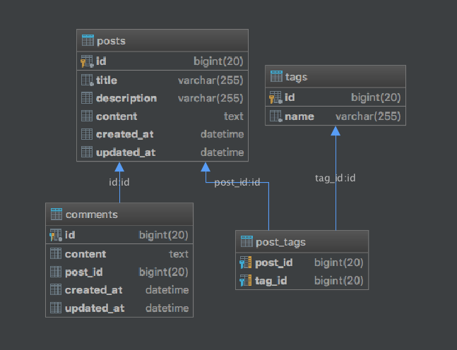

# osbr-crud
## ORM Spring based REST CRUD application
### Description
#### What is osbr?
What is `osbr` - `ORM` and `Spring` based application with `REST API` interface.
It's a simple implementation for common task in `Java` world - create `RESTful CRUD` based on `ORM`. 

* In this application we will use [liquibase](https://www.liquibase.org/) as database migration tool. 
* For decrease boilerplate code we will use [lombok](https://projectlombok.org/).
* For decrease template code we will use [Google guava](https://github.com/google/guava)

### Stack inside:
* MySQL as a database.
* Liquibase.
* Hibernate as JPA implementation.
* Spring Boot.
* Java 8.
* Gradle.
* JUnit4.
* Lombok.

And let's describe our model.
### Model
It's a common  and very simple implementation of "Library service".

Library contains three types: 
* Book 
* Author
* Genre

Library store books and can be empty.

It is worth noting:
* Each book has at least one author.
* Each Author can write more then one book and can have co-authors for book.
* Book can belong to different genres.

And it's many-to-many link for all items.

##### Library links

#### Site backend
Also we will add the possibility of discussing books by users, for this we will establish the entities:
* Post
* Tag
* Comment
* User
* UserProfile

The post may have several comments from users, may have tags.
User is simple entity for store metadata about user - password, email and etc.
UserProfile is entity for store more information about User. 

##### User and UserProfile links

##### Post, Comment and Tag links

